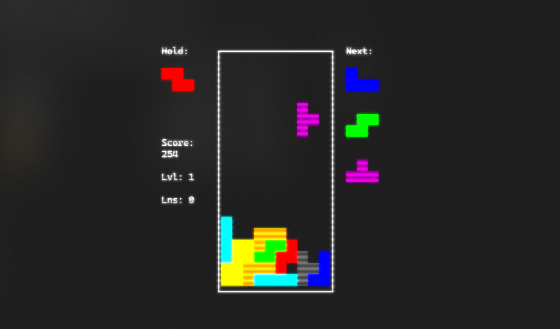

<div align="center">

# termino



A Tetris engine in Go with frame-perfect input handling and guideline-compliant mechanics.

</div>

## Features

- Super Rotation System (SRS) for piece rotation
- 7-bag randomizer for fair piece distribution
- Separate game and render loops for responsive input
- Double buffering for smooth terminal rendering
- Guideline-compliant game mechanics
- Bubbletea TUI framework

## Building

```bash
go build -o termino ./cmd/termino
```

## Running

```bash
./termino
```

## Architecture

```
termino/
├── cmd/
│   └── termino/
│       └── main.go
├── internal/
│   ├── game/
│   │   ├── engine.go
│   │   ├── logic.go
│   │   ├── randomizer.go
│   │   ├── srs.go
│   │   ├── srs_test.go
│   │   ├── state.go
│   │   └── view.go
│   ├── input/
│   │   └── handler.go
│   ├── render/
│   │   ├── buffer.go
│   │   └── terminal.go
│   └── tetromino/
│       └── pieces.go
├── pkg/
│   └── consts/
│       └── constants.go
├── go.mod
└── README.md
```

- `cmd/termino/` — Entry point
- `internal/game/` — Game logic, state, and randomizer
- `internal/render/` — Terminal rendering and buffering
- `internal/input/` — Keyboard input handling
- `internal/tetromino/` — Piece definitions and rotation system
- `pkg/consts/` — Game constants

## Dependencies

- [Bubbletea](https://github.com/charmbracelet/bubbletea) — TUI framework
- [Lipgloss](https://github.com/charmbracelet/lipgloss) — Terminal styling

## Development

Requires Go 1.25.5 or later.

```bash
go fmt ./...
go test ./...
```
